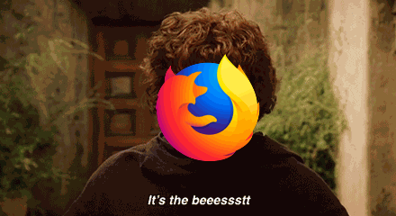

# GrIFter

Graft images onto GIFs to replace faces - make your own terrible memes with
little-to-no effort.

It's not perfect, and still a little buggy - but it works, so might as well
release it :tada:

## Setup

Setup poetry for dependencies:

    $ poetry install
    $ poetry shell

Run grifter:

    $ python -m grifter --help

## Usage

To generate a GIF with a superimposed face:

    $ python -m grifter -i input.gif -t target.png -o output.gif

This might not be perfect, so play around with `--model` and `--upscale`
until you get reasonable results.
